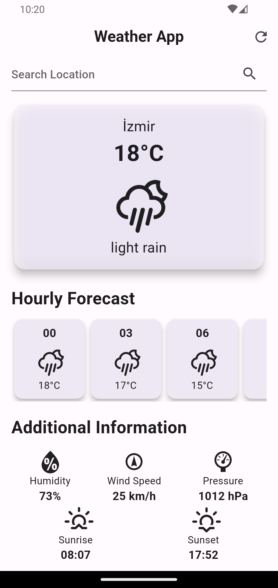

# Weather App

A simple weather application built with Flutter that provides weather information based on the user's location or a searched city.

## Features

- Display current weather information including temperature, sky condition, and city name.
- Hourly forecast for the next 24 hours.
- Additional information such as humidity, wind speed, pressure, sunrise, and sunset times.

## Screenshots



## Getting Started

1. Clone the repository:

```bash
git clone https://github.com/BiAksoy/weather-app.git
```

2. Navigate to the project directory:

```bash
cd weather-app
```

3. Install the dependencies:

```bash
flutter pub get
```

4. Run the app:

```bash
flutter run
```

## Dependencies

- [geolocator](https://pub.dev/packages/geolocator): Used to determine the user's current location.
- [http](https://pub.dev/packages/http): Used to make HTTP requests to the OpenWeatherMap API.
- [intl](https://pub.dev/packages/intl): Used to format the date and time.
- [weather_icons](https://pub.dev/packages/weather_icons): Used to display weather icons.

## Usage

When the app is launched, it first shows a splash screen with the text "Weather App." During this time, it determines the user's current location using the device's geolocation capabilities.

After determining the location, the app displays the weather information for the user's current location. The main weather page includes the current temperature, sky condition, and city name. The app also provides a search bar at the top to allow the user to search for weather information for a specific city.

The app also displays the hourly forecast for the next 24 hours. Each forecast card shows the time, weather icon, and temperature for that hour.

Additional information such as humidity, wind speed, pressure, sunrise, and sunset times is displayed below the forecast cards.

The app provides a refresh button on the app bar to update the weather information based on the user's current location.

## API Key

The app uses the [OpenWeatherMap API](https://openweathermap.org/api) to fetch weather information. To use the API, you need to sign up for an API key. Once you have the key, create a file called `secrets.dart` in the `lib` directory and add the following code:

```dart
const openWeatherAPIKey = 'YOUR_API_KEY';
```

## Contributing

Contributions are welcome. If you find any issues or want to add new features, feel free to open an issue or submit a pull request.

## License

[MIT License](LICENSE).
